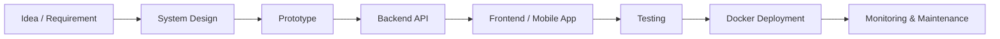

<!--
Profile README for github.com/fadzniaidil
Place this file inside the special GitHub profile repository: fadzniaidil/fadzniaidil
-->

<h1 align="center">Hi 👋, I'm Fadzni Aidil</h1>
<h3 align="center">Full-Stack Developer • Mobile App Developer • AI & Cybersecurity Researcher</h3>

  
  
  

---

## 👨‍💻 About Me

I build practical software systems that connect **mobile apps**, **backend APIs**, **automation**, **AI**, and **cybersecurity research**. My work usually sits between product development and technical experimentation: turning ideas into usable applications, APIs, research prototypes, and deployable systems.

- 🔭 Currently focused on **Flutter mobile apps**, **FastAPI microservices**, **AI systems**, and **cybersecurity research**
- 🧠 Research interest: **malware detection and classification**, especially using **hybrid deep learning**, **PE executable analysis**, and **memory forensics**
- 🧩 Backend experience with **FastAPI**, **Django**, **Flask**, **PHP CodeIgniter**, API integration, authentication, and database-driven systems
- 📱 Mobile development with **Flutter** and **Dart** for Android/iOS apps
- 🐳 Deployment stack includes **Docker**, **Docker Compose**, **Traefik**, and CI/CD workflows
- 🤖 Exploring **LLM**, **BERT**, **RAG**, vector databases, and local AI workflows
- 💬 I enjoy building systems that are useful, scalable, and easy to maintain

---

## 🛠️ Tech Stack

### Languages

  
  
  
  
  

### Mobile & Frontend

  
  
  
  
  
  

### Backend & API

  
  
  
  
  
  

### AI, Machine Learning & Research

  
  
  
  
  
  

### Databases & Infrastructure

  
  
  
  
  
  

### DevOps & Tools

  
  
  
  
  
  

---

## 🚀 Featured Projects

| Project | Description | Tech / Focus |
|---|---|---|
| [**flutter_dev**](https://github.com/fadzniaidil/flutter_dev) | Flutter development workspace including the **ChemQuick** mobile app project. | Flutter, Dart, Android, iOS |
| [**IMAWA**](https://github.com/fadzniaidil/imawa) | Intelligent Malware Analyzer web application for detecting malicious `.EXE` programs and classifying malware types using machine learning. | Python, Django, MongoDB, ML, Malware Analysis |
| [**project_BERT**](https://github.com/fadzniaidil/project_BERT) | AI/LLM experimentation repository using notebook-based workflows. | Jupyter Notebook, BERT, Mistral, NLP |
| [**model**](https://github.com/fadzniaidil/model) | Machine learning model experimentation and research notebooks. | Jupyter Notebook, AI/ML |
| [**PsyTest**](https://github.com/fadzniaidil/psytest) | Web-based counselling session system for counsellors and clients. | PHP, CodeIgniter, MySQL, Web System |
| [**eFlutter**](https://github.com/fadzniaidil/eFlutter) | Flutter course application project. | Flutter, Dart |
| [**Omnicare**](https://github.com/fadzniaidil/Omnicare) | Web-based system for pharmacy management. | Python, Flask, SQLite, Web App |
| [**fadzniaidil.github.io**](https://github.com/fadzniaidil/fadzniaidil.github.io) | Personal GitHub Pages / portfolio repository. | HTML, GitHub Pages |

---

## 🧪 Research & Technical Interests

### AI + Cybersecurity
- Malware detection and classification
- Portable Executable file analysis
- Static and dynamic malware feature extraction
- Hybrid deep learning architectures
- CNN, LSTM, Transformer, MLP, and feature fusion
- Memory forensics and malware behavior analysis

### AI Systems & LLM Applications
- BERT-based classification and semantic matching
- Retrieval-Augmented Generation systems
- ChromaDB / vector database workflows
- Local LLM workflows with Ollama and CLI-based AI tools
- AI-assisted document understanding and eligibility checking systems

### Backend, API & Platform Engineering
- Microservice architecture
- JWT authentication and RBAC
- API gateway patterns
- Dockerized deployment
- Reverse proxy routing with Traefik
- Database integration across PostgreSQL, Oracle, MongoDB, MySQL, and Redis

---

## 🧭 Development Workflow

I usually approach projects by understanding the actual workflow first, then designing a system that is practical, maintainable, and ready for future integration.

---

## 📊 GitHub Stats

  

  

  

---

## 🎯 Current Focus

- Building production-ready **Flutter mobile apps**
- Developing **FastAPI microservices** and API integrations
- Improving AI workflows using **BERT**, **RAG**, and local LLM tools
- Researching **hybrid deep learning for malware detection and classification**
- Designing scalable systems with **Docker**, **Traefik**, and database-backed services

---

## 🤝 Let's Connect

  
  
  

---

  <i>“Build useful systems, learn deeply, and keep improving one project at a time.”</i>

